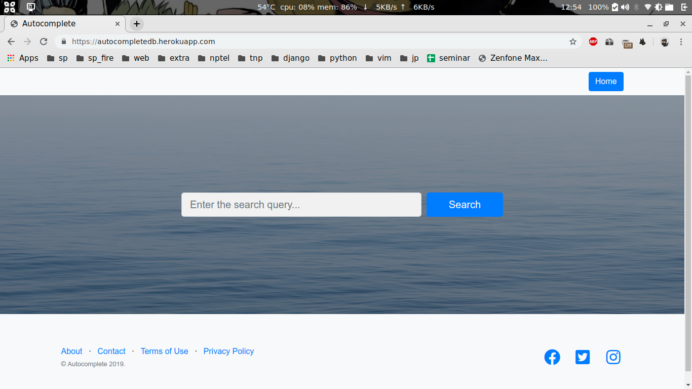
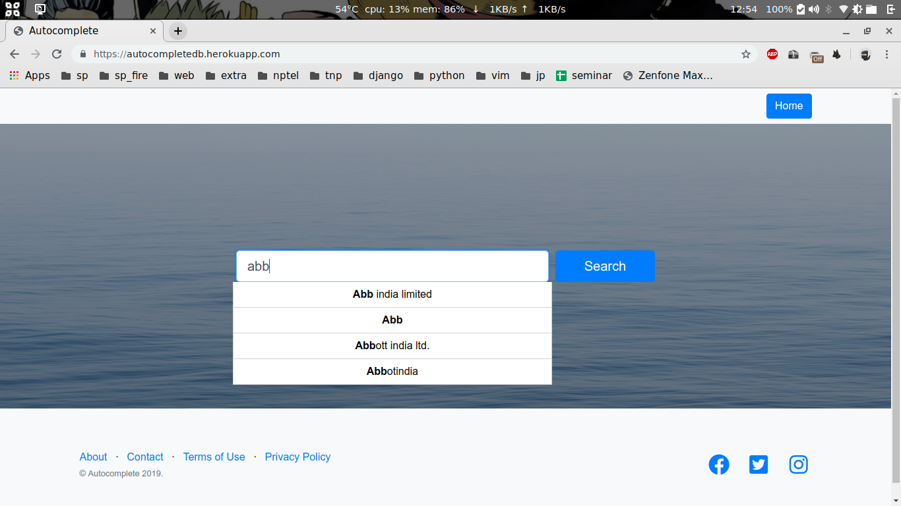
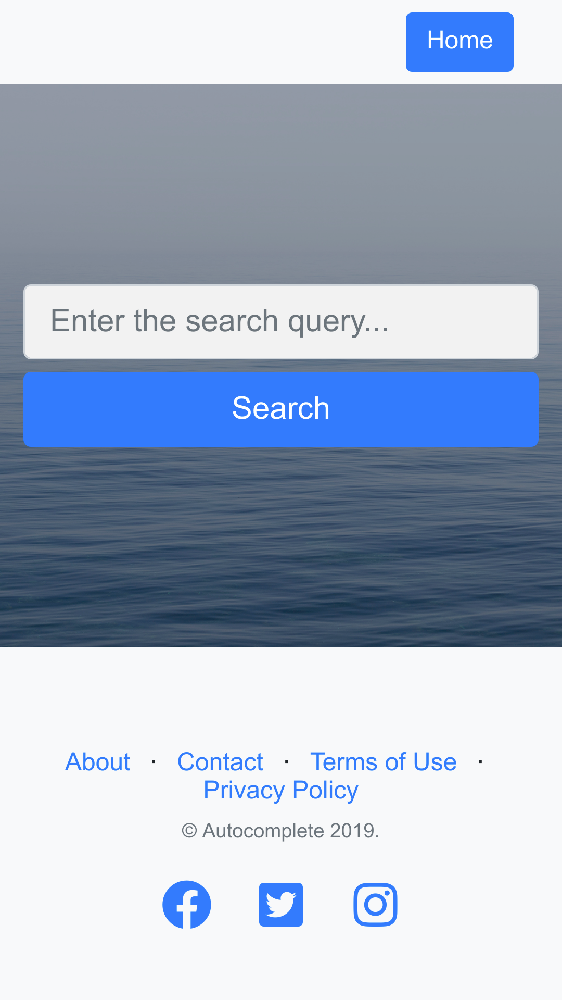
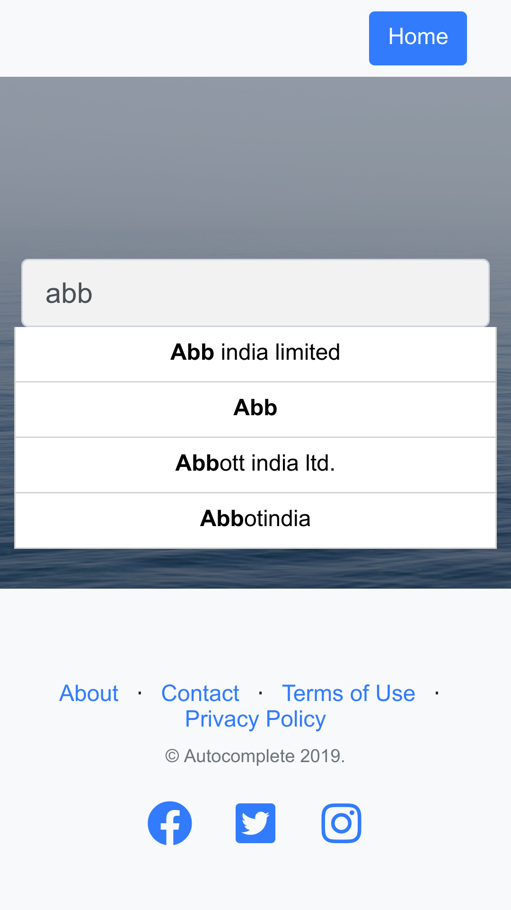

# Autocompletedb

## The following repo shows suggestions for searches based on the search query in database

### Uses PostgreSQL as the dbms and django framework
#### For the search to show the suggestions based on fields, place the fields in db.

--------------
## Desktop view

------------------

## Mobile view

